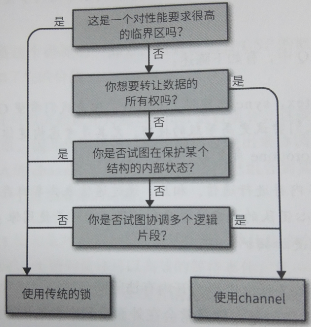

> This is the full sourcecode for the book, "Concurrency in Go" published by O'Reilly.For errata and more information, please refer to the book's hub at http://katherine.cox-buday.com/concurrency-in-go. 该项fork自 https://github.com/kat-co/concurrency-in-go-src, 用于学习《Go语言并发之道》.

## Go语言并发之道（katherine Cox-Buday著）

### 第2章   对你的代码建模：通信顺序进程



### 第4章   Go语言的并发组件

**sync.WaitGroup**
``` golang
创建：var wg sync.WatiGroup
使用：
    wg.Add(n)
    wg.Done() 
    wg.Wait() 在n次wg.Done()前，处于阻塞状态
```

**sync.Mutex**
``` golang
创建：var mu sync.Mutex
使用：
    mu.Lock()
    mu.Unlock()
```

**sync.RWMutex**读写锁
``` golang
创建：var mu sync.RWMutex
使用：
    mu.Lock()
    mu.Unlock()
    mu.RLocker()
    mu.RLock()
    mu.RUnlock()
```

**sync.Cond**
``` golang
创建：cond := sync.NewCond(&sync.Mutex{})
等待操作：
    cond.L.Lock()
    cond.wait() // 注意：wait()在进入时会Unlock，在退出时会Lock；故wait前必须要有Lock，wait后必须要Unlock
    cond.L.Unlock()
取消等待操作：
    cond.Singal()  // 从多个wait中任选一个取消wait
    cond.Broadcast()    // 取消所有wait 
```

**sync.Once**
``` golang
创建：var once sync.Once
使用：
    once.Do(函数)   // 注意一个Once只与第一次Do调用的函数相关联，且只执行一次该函数，以后再调用Do不会执行函数，也就是说Once能保证函数只被调用一次
```

**sync.Pool**
``` golang
创建：
    calcPool := &sync.Pool(
        New: func() interface{} {
            mem := make([]int, 10)
            return mem
        }
    )
使用：
    // 初始化
    calcPool.Put(calcPool.New())
    calcPool.Put(calcPool.New())
    calcPool.Put(calcPool.New())
    calcPool.Put(calcPool.New())

    // 使用
    mem := calcPool.Get()
    defer calcPool.Put(mem) // 注意：使用完后Put回去，才能重复利用
```

**channel**

<table>
    <tr>
        <td>操作</td>
        <td>Channel状态</td>
        <td>结果</td>
    </tr>
    <tr>
        <td rowspan=6>Read</td>
    </tr>
    <tr>
        <td>nil</td>
        <td>阻塞</td>
    </tr>
    <tr>
        <td>打开且非空</td>
        <td>输出值</td>
    </tr>
    <tr>
        <td>打开但空</td>
        <td>阻塞</td>
    </tr>
    <tr>
        <td>关闭的</td>
        <td><默认值>,false</td>
    </tr>
    <tr>
        <td>只写</td>
        <td>编译错误</td>
    </tr>
    <tr>
        <td rowspan=6>Write</td>
    </tr>
    <tr>
        <td>nil</td>
        <td>阻塞</td>
    </tr>
    <tr>
        <td>打开但填满</td>
        <td>阻塞</td>
    </tr>
    <tr>
        <td>打开但未填满</td>
        <td>写入</td>
    </tr>
    <tr>
        <td>关闭的</td>
        <td>panic</td>
    </tr>
    <tr>
        <td>只读</td>
        <td>编译错误</td>
    </tr>
    <tr>
        <td rowspan=6>close</td>
    </tr>
    <tr>
        <td>nil</td>
        <td>panic</td>
    </tr>
    <tr>
        <td>打开且非空</td>
        <td>关闭Channel；读取成功，直到通道耗尽，然后读取产生的默认值</td>
    </tr>
    <tr>
        <td>打开但空</td>
        <td>关闭Channel；读到生产者的默认值</td>
    </tr>
    <tr>
        <td>关闭的</td>
        <td>panic</td>
    </tr>
    <tr>
        <td>只读</td>
        <td>编译错误</td>
    </tr>
</table>

**select**
``` golang
// 注：在select中的选择每个case运行的概率相同
select {
    case <- c1:
     . . . 
    case <- c2:
     . . .
    case <- time.After(1 * time.Second):
     . . .
    default:
     如果都阻塞，则执行default，非必须
}

```

**GOMAXPROCS**
``` golang
runtime.GOMAXPROCS(runtime.NumCPU())
// 可以通过将GOMAXPROCS设置为较大值，使更频繁触发竞争条件
```


